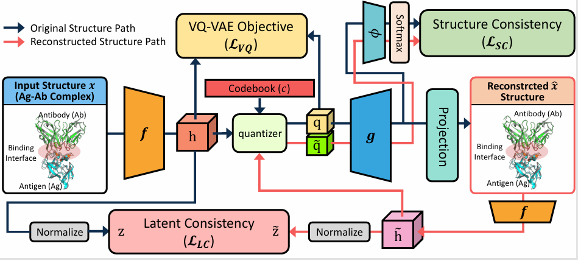

# Tokenizing Antibody–Antigen Complex Structures via Energy-Based Surrogates

The official source code for **Tokenizing Antibody–Antigen Complex Structures via Energy-Based Surrogates**

## Overview

</img>

## Requirements
- Python version : 3.11.13
- Pytorch version : 2.2.2

## Download data

Create the directory to save dataset.
```
mkdir antibody_data/rabd
```

You can download preprocessed data [here](https://www.dropbox.com/scl/fo/k7zpdow7ylqp9glwvr6yc/AB9CUD7YXfC25dbHLlL3UeE?rlkey=eoqdfeega9piqv8qtfz9e2kr7&st=xjjlcurl&dl=0)

## Download checkpoints

Create the directory to save our checkpoints.
```
mkdir logs
```

You can download trained checkpoints [here](https://www.dropbox.com/scl/fo/kgvnqg5f1mownx71pchxm/AM4lBFnDhk3Ae6c6fiNE0IA?rlkey=px89mjczn28c9ztrsqfrfeyk3&st=nhl2o44g&dl=0)

## Download pdb data from SABDAb Database

Please download all structure data from the official [SAbDab website](https://opig.stats.ox.ac.uk/webapps/sabdab-sabpred/sabdab/search/?all=true#downloads) and set

```
pdb_path="path_to_the_directory_where_the_files_are_saved"
```

## How to Run

You can simply reproduce the result with follwing codes  
```
DIR="project directory"
DIR=$DIR pdb_data_dir=$pdb_path bash sh/evaluate.sh
```


